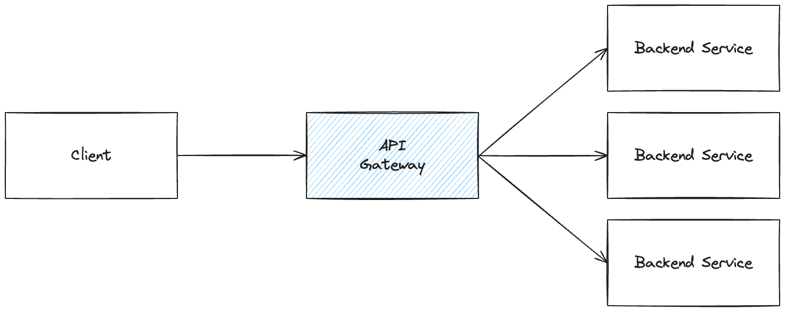

# Full Cycle API Gateway

This repository holds all the code and notes produced during the API Gateway module of the Full Cycle course. 

## API Gateway

An API gateway is a tool for API management positioned between a client and a set of backend services. Functioning as a reverse proxy, the API gateway receives all application programming interface (API) calls, consolidates the diverse services needed to fulfill them, and then delivers the relevant results.

It is the only entry point for a set of services, therefore it is a single point of failure and needs extra attention to security and availability. It is also a single point of control, which means that it can be used to implement security policies, rate limiting, and other features.

### Advantages and disadvantages

#### Advantages

- Feature Standardization: Implementation of standardized features like logging and security to ensure consistency and reliability throughout the system.

- Network Governance Support: Assists in overseeing and managing the overall governance of the company's network, ensuring compliance with established policies for a secure and efficient infrastructure.

- Centralized Network Entry Point: Establishes a single point of entry into the network, streamlining access for users and simplifying overall network management.

- Facilitated Management: Simplifies the administration and control of network resources, reducing complexity and enhancing the efficiency of network management tasks.

- Essential API Strategy Tool: Plays a crucial role in adopting an API strategy, supporting seamless integration and communication between different software applications.

#### Disadvantages

- Single Point of Failure: The API gateway is a single point of failure, which means that if it goes down, the entire system will go down with it.

- Increased Complexity: The API gateway is a complex system that requires a high level of expertise to implement and maintain.

- Performance Bottlenecks: The API gateway can become a performance bottleneck if it is not properly configured and optimized.

- Security Concerns: The API gateway is a potential security risk, as it exposes the internal network to external threats.

## Kong API Gateway

Kong is an open-source API gateway and microservice management layer. It is a scalable, fast, and extensible platform written in Lua that helps you manage your APIs and microservices. Kong runs in front of any RESTful API and is extended through plugins, which provide extra functionality and services beyond the core platform. Most of the plugins are available as open source, but some are commercial and require a license to be used.

### Deployment

- DB-less mode: Where all the configuration is stored in memory based on a YAML or JSON file. 
- With a database: Where all the configuration is stored in a database, PostgreSQL or Cassandra for exemple

#### Distributed deployment

Kong can be deployed in a distributed manner, where the control plane and the data plane are separated. The control plane is responsible for managing the configuration and the data plane is responsible for handling the requests. 

#### Hybrid deployment

Kong can be deployed in a hybrid manner, where the control plane and the data plane are combined and the Gateway instances stay separated. This can potentially improve performance and reduce latency since the amount of hits to the database is reduced.

## Konga

Konga serves as a web-based user interface for the Kong Admin API, providing a straightforward, swift, and user-friendly means to oversee your Kong Gateway setup. This project is both free and open-source, operating under the Apache 2.0 license. Additionally, Konga is constructed on the foundation of Node.js, AngularJS, and Bootstrap 3.

## Running locally
 
1. Make sure to have Docker and Docker Compose installed
1. Clone this repository
1. Run `docker-compose up -d` to start the containers
1. Access Konga at http://localhost:1337